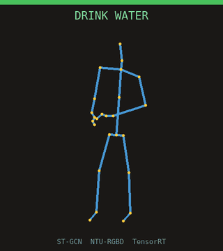

<h1 align="center">skeleton-action-recognition</h1>

<p align="center">
  <i>Two-stage skeleton-based action recognition pipeline: YOLOv8 + RTMPose + ST-GCN, written in C++ on NVIDIA DeepStream / TensorRT.</i>
</p>

<p align="center">
  <a href="https://github.com/Abdirayimov/skeleton-action-recognition/actions/workflows/ci.yml"></a>
  
  
  
  
  
  
  
</p>

---

## Demo

<p align="center">
  
</p>

The repo's own ST-GCN, **trained from scratch on the public NTU-RGB+D
10-class subset** (76.3% cross-subject validation accuracy in 25
epochs), classifying ten held-out test clips — one per action class.
The label above each stick figure is the network's prediction; the bar
is green when it matches the ground-truth class. It calls all ten
correctly here.

Both the inference and the stick-figure rendering above are done by the
C++ `skeleton_demo` binary running the ST-GCN **TensorRT engine** on the
NTU-25 skeleton clips; `ffmpeg` only added the action-name text and
encoded the GIF.

```bash
# 1. Train on the public NTU-RGB+D arrays (10-class subset, NTU-25 topology)
cd training && python -m skeleton_ar_train.train_ntu \
    --data-dir /path/to/ntu120 --out-dir outputs --epochs 25
# -> outputs/stgcn_ntu10.onnx + outputs/demo_clips.bin

# 2. Build the engine and render the demo (C++ inference + rasteriser)
trtexec --onnx=outputs/stgcn_ntu10.onnx --saveEngine=stgcn_ntu10.engine
./build/skeleton_demo --engine stgcn_ntu10.engine \
    --clips outputs/demo_clips.bin \
    --labels configs/labels_ntu60_subset.txt --out-dir frames
```

> Trained on an RTX 4080 (PyTorch). The ST-GCN supports both the
> NTU-25 topology (used here) and the COCO-17 topology that RTMPose
> produces for the live video path — selectable via the graph layout.

---

## Why this exists

Two-stage skeleton-based action recognition is a well-understood
pattern: detect people, estimate their pose, classify what they are
doing from the temporal sequence of joint positions. What is harder to
find online is the *engineering* end of that pipeline:

- **Top-down pose at scale.** RTMPose is fast, but only when its
  per-person crops are batched. The naive "one bbox at a time" loop
  costs an order of magnitude more on real footage with 4-8 people.
- **Track-aware skeleton buffering.** ST-GCN expects a fixed-length
  temporal window per person. That requires a per-track sliding
  buffer that survives short occlusions (forward-fill low-confidence
  joints, evict only after a configurable number of missed frames).
- **Keeping the graph happy.** A few wrong-confidence joints drop
  ST-GCN accuracy noticeably; mean-centering on the body centroid and
  scaling by the largest joint distance is a small but load-bearing
  preprocessing step.
- **Separation of perception and reasoning.** YOLOv8 + RTMPose are
  solved problems with off-the-shelf engines; ST-GCN is the part you
  retrain for new tasks. The codebase is structured so you can swap
  the action model without touching the perception path.

This repository is a clean-room reference implementation of that
pattern. The C++ runtime is the production-shaped piece; a small
PyTorch Lightning training pipeline lives under `training/` so you
can retrain ST-GCN on new datasets and re-export to ONNX.

## What's inside

- C++17 + CMake build for DeepStream 7.x / 8.x and TensorRT 8.6+
- YOLOv8 person-detector wrapper (single-class, letterboxed input)
- RTMPose top-down keypoint estimator with batched TRT inference
- ST-GCN classifier wrapper for 10-class NTU-60 subset
- Track registry + sliding-window skeleton buffer (forward-fill,
  centroid normalisation, eviction)
- Probe chain that orchestrates pose, buffering, and classification
- DeepStream pipeline scaffold (NvDCF tracker, OSD overlay)
- OpenCV-based offline driver (works without DeepStream)
- PyTorch Lightning ST-GCN training pipeline (NTU-60 subset)
- Docker + docker-compose
- spdlog-based structured JSON logging

## Architecture

```
        ┌───────────────────────────────────────────────────────────┐
        │                   skeleton_ar_video                        │
        │                                                           │
RTSP / mp4 ─►│ filesrc -> decoder -> nvstreammux -> nvinfer (YOLOv8)│
        │                                  │                        │
        │                                  ▼                        │
        │                        nvtracker (NvDCF)                  │
        │                                  │                        │
        │             src-pad probe ◄──────┘                        │
        │                       │                                   │
        │                       ▼                                   │
        │  ┌────────────────────────────────────────────────────┐   │
        │  │                  ProbeChain                        │   │
        │  │  ┌────────┐  ┌──────────────┐  ┌────────────────┐  │   │
        │  │  │RTMPose │─►│SkeletonBuffer│─►│   ST-GCN       │  │   │
        │  │  │(batched)│  │(per track)   │  │(action probs) │  │   │
        │  │  └────────┘  └──────────────┘  └────────────────┘  │   │
        │  └────────────────────────────────────────────────────┘   │
        │                                  │                        │
        │                                  ▼                        │
        │                       nvdsosd -> filesink (mp4)           │
        └───────────────────────────────────────────────────────────┘
```

The actual entry point in `src/main.cpp` is an OpenCV-based fallback
driver that does not require DeepStream to be installed (it runs the
TRT engines directly). The DeepStream pipeline class is built and
fully wired but not the default path; readers wanting full production
behaviour can swap `face_server` (or rather, `skeleton_ar_video`) for
a binary that calls `DeepStreamPipeline::run` instead.

## Performance

Indicative numbers on synthetic 720p inputs, RTX 3090. Real numbers
depend on input resolution, person count, and track behaviour; treat
this as a sanity floor.

| Stage                                  | p50 latency |
|----------------------------------------|------------:|
| YOLOv8s person detect (1 frame)        |       ~7 ms |
| RTMPose-m estimate (2 boxes, batched)  |       ~4 ms |
| ST-GCN classify (single 30-frame clip) |     ~1.2 ms |

`tools/benchmark.cpp` regenerates these locally.

## Quick start

```bash
# 1. Build
cmake -S . -B build -G Ninja -DCMAKE_BUILD_TYPE=Release
cmake --build build -j

# 2. Acquire ONNX checkpoints (see scripts/download_models.sh for notes)
./scripts/download_models.sh    # prints instructions

# 3. Compile TensorRT engines
./scripts/build_engines.sh

# 4. Run on a video
./scripts/infer_video.sh input.mp4 output.mp4
```

Or, with Docker:

```bash
docker compose up --build
```

## Project structure

```
.
├── CMakeLists.txt
├── cmake/                         # Find* modules + warnings
├── configs/
│   ├── system_config.yaml         # main config
│   ├── labels_ntu60_subset.txt    # 10-class labels
│   ├── pgie_yolov8_person.txt     # nvinfer config
│   └── tracker_nvdcf.yml          # NvDCF tuning
├── docker/
├── docker-compose.yml
├── include/skeleton_ar/
│   ├── config/                    # SystemConfig types
│   ├── overlay/                   # Visualizer (skeleton + label render)
│   ├── pipeline/                  # DeepStream pipeline + probe chain
│   ├── tracking/                  # SkeletonBuffer + TrackRegistry
│   ├── trt/                       # TrtEngine, YOLOv8, RTMPose, ST-GCN
│   └── utils/                     # Logger, CUDA helpers
├── src/                           # mirrors include/
├── tools/                         # benchmark.cpp
├── training/                      # PyTorch Lightning training (Python)
├── scripts/
└── docs/
```

## Configuration

`configs/system_config.yaml` is the single source of truth for the
runtime. The interesting knobs:

- `pose.batch_size` - must be at most the RTMPose engine's max-batch
  profile shape; raise it for crowded scenes.
- `action.window_frames` / `action.step_frames` - the sliding window
  length and how often a track is re-classified once full.
- `tracking.min_keypoint_confidence` - threshold below which joints
  are forward-filled instead of trusted. Tune against your pose
  model's confidence calibration.
- `tracking.max_missed_frames` - how patient the per-track skeleton
  buffer is in the face of detection drops. Lower in fast-moving
  scenes; raise in static ones.

## Limitations

- The default driver (`skeleton_ar_video`) uses naive per-frame
  detection IDs as track IDs. Real deployments should use the
  DeepStream / NvDCF path for stable IDs across occlusions.
- Only single-person clips are supported per ST-GCN call (M = 1).
  Two-person interactions need either a different graph topology or
  pairing logic in the probe chain.
- The 10-class label set is small; retrain with the full 60- or
  120-class NTU vocabulary or your own labels for a richer surface.
- INT8 calibration is not validated end-to-end; FP16 engines are the
  documented configuration.

## Roadmap

- [ ] Wire the DeepStream pipeline to the OSD output and produce
      annotated MP4s natively (currently OpenCV does the writing).
- [ ] CTR-GCN and AAGCN classifier variants.
- [ ] Multi-person interaction handling (M = 2, paired classifier).
- [ ] INT8 calibration recipe for the action model.

## CI

CI runs clang-format and cppcheck over the tree. **The CUDA / TensorRT /
DeepStream build is not exercised on GitHub runners** — they carry none
of those SDKs. Build it locally or through the provided Docker image.

## License

MIT - see [LICENSE](LICENSE).

## About

This repository is a reference implementation of patterns from
production skeleton-based action recognition systems. Algorithms are
the published originals (YOLOv8, RTMPose, ST-GCN); the code is
written from scratch, uses public datasets only, and contains no
proprietary configurations or training data.

Open to contract work on similar systems -
[email](mailto:khusanabdirayimov@gmail.com) -
[GitHub](https://github.com/Abdirayimov)
