# Architecture

## Pipeline graph

```mermaid
flowchart LR
    Vid[mp4 / RTSP] --> Mux[nvstreammux]
    Mux --> Det[nvinfer YOLOv8]
    Det --> Trk[nvtracker NvDCF]
    Trk -->|track_id, bbox| Probe[src-pad probe]
    Probe --> Pose[RTMPose batched]
    Pose --> Buf[Per-track SkeletonBuffer]
    Buf -->|window full| ST[ST-GCN classify_batch]
    ST --> Reg[TrackRegistry latest_action]
    Reg --> OSD[nvdsosd / Visualizer]
    OSD --> Out[mp4]
```

## Two stages, one pipeline

The "two-stage" naming refers to the model architecture, not the
deployment. On disk we have three engines (detector, pose estimator,
classifier), but at runtime they share a single nvstreammux and a
single CUDA context per worker. The src-pad probe runs after the
tracker and orchestrates the rest synchronously: by the time the
pipeline element returns, every track has its action label updated.

## Why a per-track buffer

Earlier iterations of this code tried to feed the action classifier on
every frame using only the most recent joint positions; classification
was unstable and label flicker was nasty. The fix is the standard one:
a sliding window per track so the classifier sees a real motion
signature rather than a single instant.

The buffer policy is small but matters:

- **Forward-fill on low confidence.** Replacing low-confidence
  detections with the previous frame's joints keeps the input shape
  meaningful even when the pose model briefly loses a wrist.
- **Centroid centering + scale normalisation.** Translating the
  spine-root to the origin and dividing by the maximum joint distance
  removes most of the variance from camera framing.
- **Stride.** Re-classifying every frame is wasteful (the labels
  rarely change that fast). We only re-run the classifier every
  `step_frames` frames per track.

## Threading model

- The OpenCV-only driver (`skeleton_ar_video`) is single-threaded;
  detector / pose / classifier all run on the same CUDA stream per
  call.
- The DeepStream pipeline runs the GLib main loop on its own thread.
  The probe chain runs on a streaming thread owned by `nvtracker`,
  so heavy work in the probe will throttle upstream.

## Failure modes

- **Detector misses a track.** `track_registry.age_unobserved()`
  bumps the missed counter; if it exceeds `max_missed_frames`, the
  buffer is evicted entirely and the next observation creates a new
  track id.
- **Engine batch profile too small.** RTMPose calls split the batch
  if it exceeds `pose.batch_size`. ST-GCN does not split; the engine
  must be built with a max-batch >= the largest "ready_tracks" count
  you expect.
- **NTU vs COCO topology.** RTMPose ships COCO-17. The training
  pipeline projects NTU-25 down to COCO-17 in `prepare_ntu60.py`.
  Other datasets need their own projection.
